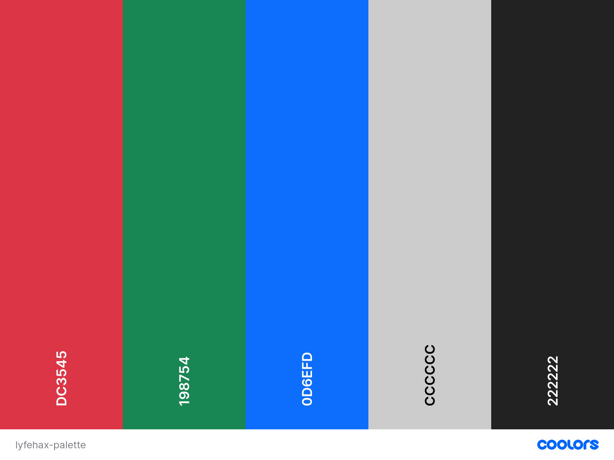

# Gaming Trivia

## Project Objective

To create a life hacks quick tips website where users can share their tips and tricks with other web users. They will be able to create a basic account which will allow them to post content. Content will contain a title, category and body element within which users can input data. Once the user posts their content to the page the post will be assigned the username of the content creator and will also have the date it was posted. Users will be able to edit and delete their posts as well but won't have the same ability to edit or delete other user posts. "Hax" is what I will be referring to as the plural of hacks for this project just to move away from the generic.

## Website Design Goals

- Design a front end for a data-driven web application that meets accessibility guidelines, follows the principles of UX design, meets its given purpose and provides a set of     user interactions
- Implement custom HTML and CSS code to create a responsive full-stack application consisting of one or more HTML pages with relevant responses to user actions and a set of data   manipulation functions
- Build a non-relational database-backed Flask web application that allows users to store and manipulate data records about a particular domain
- Design a database structure that is relevant for your domain, consisting of a minimum of one collection
- Design and implement manual test procedures to assess functionality, usability, responsiveness and data management within the Full Stack web application
- Write Python code that is consistent in style and conforms to the PEP8 style guide (or another explicitly mentioned style guide, such as Google's) and validated HTML and CSS     code
- Include sufficient custom Python logic to to demonstrate your proficiency in the language
- Include functions with compound statements such as if conditions and/or loops in your Python code
- Write code that meets minimum standards for readability (comments, indentation, consistent and meaningful naming conventions)
- Name files consistently and descriptively, without spaces or capitalisation to allow for cross-platform compatibility
- Design a data model that fits the purpose of the project
- Develop the model into a usable non-relational database where data is stored in a consistent
  and well-organised manner
- Create functionality for users to create, locate, display, edit and delete records
- Deploy a final version of the full-stack application code to a cloud-based hosting platform
  (e.g. Heroku) and test to ensure it matches the development version
- Ensure that final deployed code is free of commented out code and has no broken internal
  links
- Document the deployment process in a README file in English that also explains the
  application’s purpose and the value that it provides to its users
- Use Git & GitHub for version control of a Full Stack web application up to deployment, using
  commit messages to document the development process.
- Commit final code that is free of any passwords or security sensitive information, to the
  repository and to the hosting platform
- Use environment variables, or files that are in .gitignore, to hide all secret keys
- Ensure that DEBUG mode is turned off in production versions

## User Stories


- As a user, I want to be able to view the posts of website members and navigate through them intuatively
- As a user, I want to be able to join as a member and begin posting my own content
- As a user, I want the website to store my membership credentials securely in a database
- As a user, I want the website to keep my posts assigned to my user profile with my username visible to other users
- As a user, I as a member, want to be able to edit and delete posts as well as submit posts
- As a user, I as an admin, want to be able to delete any users posts should they breach community guidelines


## User Requirements and Expectations

### Site Owner/Administrator

#### Requirements

The Site Owner/Administrator will require the site to collect and store data from user posts, such as text, date, username, and special key data. The text will be the users 'hax'. The posts include the date in the format: DD/MM/YYYY. The username will be the users identity for posting on the site. A special key will be assigned to the individual users so that they, and their previous contributions and actions on the site, can be tracked and identified quickly in the database. 

#### Expectations

The Site Owner/Administrator will expect the site to load correctly without visual errors. This means having all images, fonts and formats loading without overflowing or clashing with other sections of the page. The posts of users must be clearly distinguishable between each other with margins and borders marking where one post ends and the next begins. I want the username and date of posting to appear in the appropriate location on every post, with username in top left and date in top right, and to be of legible size on all screen widths. 

The site must scale appropriately on all screen widths and utilise the BOOTSTRAP grid effectively. The colours and images must be appropriate for the theme of the website. The colours must be attractive to the user without affecting overall readability of the content.

### Standard User

#### Requirements

They will require the site to allow them to make a membership account and post onto the main page for other users to see. They also need the site to allow them to easily navigate around it. They need to be able to see other users posts with key identifiers such as usernames and dates posted. They need the site to scale appropriately for their large and small devices so that usability or appearance isn't affected when switching between them. 

#### Expectations

They will expect the navigation elements to be similiar to what they have seen on other sites (established norms), so they can easily jump in without having to learn specific UI quirks. They will want the navbar to be sticky so that they can always click on the site logo and other navbar elements to bring them wherever they want to go. For mobile devices and small screens, they will expect the nav elements to merge into a burger icon which produces a menu transition when tapped, so as not to crowd the screen. They will want all the text and posts to be styled and ordered well.


## Design Choices

### Visual Design Choices

#### Fonts

For fonts I went with [Urbanist](https://fonts.google.com/specimen/Urbanist#standard-styles), which is a low-contrast, geometric sans-serif inspired by Modernist typography and design. It was created using elementary shapesand its neutrality makes it a versatile display font for print and digital mediums. I went for the font weight of 400, 500, and 600. 

#### Icons

I am using icons from Font [Awesome's](https://fontawesome.com/v5.15/icons?d=gallery&p=2&m=free) free gallery. These icons include the recognisable icons used for popular social media platforms.

#### Colors

I used [Coolers](https://coolors.co/) to create this neat palette image. Detail on the use of of each color below.


- #222 Eerie Black: This will be the primary base color for the whole site; all other colors will be layered over it
- #ccc Light Grey: This will be used to color all text elements and form fields; text within form fields will inherit the #222 base color
- #dc3545 Rusty Red: I have used this as a warning color for any cancel or delete buttons. The visual feedback provides defensive measures against user error
- #198754 Sea Green: I have used this color as a background for the flash messages and any confirm buttons. This again provides some visual feedback for the user and draws attention to where it is needed.
- #0d6efd Blue Crayola

#### Structure

The structure is controlled using [Bootstrap v5.1.1](https://getbootstrap.com/docs/5.0/getting-started/introduction/). This grid system allowed me to set responsive html elements without the need to write media queries for each screen width breakpoint. I have written css styles for the various elements on the site and tweaked the positioning of certain elements within the row/column structure. For smaller screens I hide certain elements, such as hero images, so as not to crowd the page for the user.

## Wireframes

Here are the links to my wireframes. They were created using [Balsamic](https://balsamiq.com/wireframes/) software:

### [Desktop Wireframe Folder](wireframes/desktop)

### [Tablet Wireframe Folder](wireframes/mobile)

### [Mobile Wireframe Folder](wireframes/tablet)

## Database Structure

I have used MongoDB to set up the database for this project with the following collections:

#### users:

Key      | Value
---------|-----------
_id      | ObjectId
username | String
password | String

#### hax:

Key             | Value
----------------|-----------
_id             | ObjectId
category_name   | String
hax_title       | String
hax_text_body   | String
post_date       | String
posted_by       | String

#### categories:

Key             | Value
----------------|-----------
_id             | ObjectId
category_name   | String

## Features
### NavBar

The navbar has been set to sticky and will follow the user as they scroll down the page. The navbar contains the website brand, which is Lyfehax.ie, as well as the nav elements of Home, Hax, Sign Up, Log In, Log Out, Add New Hax, and Profile. These elements can merge into a hamburger on smaller screens and will appear as a dropdown menu once the hamburger element is clicked with items floated to the right.

### Home/Index Page

The home page has two image carousels depicting workshops, tool collections, and arts and crafts. These are to signal the purpose of the site to first time users and to add visual decoration. Beneath the hero images, the intro section details to new users the purpose of the site, explains what a "Life Hack" is and has a contact form section at the bottom for users to get in touch.

### Hax Page

 The 'Hax', what I will be referring to as the user posts, will be displayed in decending order. Each of the hax will have a title, the username of the poster, the date it was posted, and the body. If the user has created a hax they will have EDIT and DELETE buttons available to them. These buttons will highlight blue for edit, green for add, and red for delete to give user feedback on what they are clicking. 
### Sign Up Page

On this page the user will be encouraged to sign up to become a user on the site. This will allow them the ability to create, edit, and delete posts of their own where a standard visitor is only able to read posts. The form has three input sections: A Password, Repeat Password Check and Username. Once the user has completed the form correctly, and clicked the submit button, they will be linked to their new profile page, with a welcome message displayed, and the data they inputted in the form will be saved to the database. 

### Log In Page

 The Log In page has a similar layout to the Sign Up page with the only real difference being there is no password check for returning users. The grid is split into two colomns with a decorative image on one side and the injected Log In form on the other.

### Add Hax Post

The Add New Hax page will contain a form, decorated with FontAwesome icons, where users can create a new "HAX" post. They have between 5 and 50 characters for the title, a choice of available categories from a dropdown menu, and a main body with an allowed length of between 30 and 600 characters. This is to stop users from posting spam posts with little to no or too much data in them.

### Footer

The footer element is displayed across all pages and contains social media links for the site owner to link to this sites associated social media accounts. The links are to Facebook, Instagram, Youtube and Twitter. Their real world application would be for if Lyfehax became a recognisable brand and needed a social media footprint.

### Features in Summary

- Intuitive navigation
- Registration functionality
- Sign-In and Out functionality
- CRUD Functions:
    - Create: user posts assigned to your user id
    - Read: view the posts on the main hax page
    - Update: able to update previous user posts assigned to your user_id
    - Delete: able to remove previous posts assigned to user_id


### Features to be implemented

- Have the home page contact form provide visual feedback for the user upon completion and upload data to database
- Have a customizable user profile with, profile image, preferences and email to which you can send updates, newsletters etc
- Have a 'forget password' functionality
- Add pagination so the list of hax will be displayed with a max of 20 logs per page
- Give the pagination interface buttons for sorting such as by date, ascending or decending
### Languages

- [HTML](https://en.wikipedia.org/wiki/HTML)
- [CSS](https://en.wikipedia.org/wiki/Cascading_Style_Sheets)
- [JavaScript](https://en.wikipedia.org/wiki/JavaScript)
- [Python](https://www.python.org/)

### Framworks & External Liberaries

- [Bootstrap](https://getbootstrap.com/docs/5.0/getting-started/introduction/)
- [Font Awesome](https://fontawesome.com/)
- [Google Fonts](https://fonts.google.com/)
- [Jinja](https://jinja.palletsprojects.com/en/3.0.x/)
- [Flask](https://flask.palletsprojects.com/en/2.0.x/)

### Tools

- [Git](https://git-scm.com/)
- [GitPod](https://www.gitpod.io/)
- [Heroku](https://www.heroku.com/)
- [Balsamic](https://balsamiq.com/wireframes/)
- [W3C HTML Validation Service](https://validator.w3.org/)
- [W3C CSS Validation Service](https://jigsaw.w3.org/css-validator/)
- [techsini](http://techsini.com/)
- [MongoDB Atlas](https://www.mongodb.com/)
- [Flask](https://flask.palletsprojects.com/en/1.1.x/)
- [PyMongo](https://api.mongodb.com/python/current/tutorial.html)
- [Jinja](https://jinja.palletsprojects.com/en/2.11.x/)

## Testing of Interactive Elements

### Navigaton

#### User Story:  As a user, I want to be able to navigate around the sight intuitively
### Plan

The user must be able to navigate the sight with ease and locate whatever they seek on the sight. This will require:
- A responsive navbar
- Working buttons which provide visual feedback
- An active class which reminds user what page they are on

### Implementation

The navbar is sticky and available across all pages of the site to give the user options wherever they go. It contains the website brand, which is Lyfehax.ie, as well as the nav elements of Home, Hax, Sign Up, Log In, Log Out, Add New Hax, and Profile. These elements can merge into a hamburger on smaller screens and will appear as a dropdown menu once the hamburger element is clicked with items floated to the right. 

The active class has been enabled using jinja template language and will trigger based on whether the keyword matches up with the request path of the url.

All button elements on forms will change color according to their associated role ie delete = red, add = green etc. They adopt their bootstrap class as the user hovers their cursor on the button.


### Test

I have clicked through every link on the navbar to make sure no paths are broken. I have observed that the active class trigger is working as intended and tracks the user based on what page they are on.

All button elements are hovered over and clicked on with the cursor.

I have scrolled up and down the page to test the sticky nav setting. I also checked smaller screen widths to see if burger collapse was working as intended.

### Result

All nav links working as intended and take the user to the intended location on the site.

Active class is tracking as intended. Sticky setting and burger collapse working as intended.

Button elements working as intended.

### Sign Up

#### User Story: As a user, I want to be able to join as a member and begin posting my own content

### Plan

To create a sign up form where the user can fill in a new username and password. The user will be asked to repeat password to confirm correct key inputs. After signing in, the user will be redirected to the profile page.
The user will be notified of their success via a flash message and they will now be able to create, edit, and delete posts assigned to their account. The signup page should detect if the user already exists in the database before actioning the new sign up request. This is to stop duplicate account creation.

### Implementation

The form is injected into the signup template from my template form components folder. The inputs available are username, password, and repeat password. The user is notified to only use numbers and letters in their username and password creation and the form will only allow between 5 and 15 characters for each input field. The form cannot be submitted unless all fields are filled out.

Once the user has filled out the form and submitted, they will be taken to their profile with a welcome message displayed. Also, the nav elements "Sign Up" and "Log In" will be hidden from view as they are not relevant to the logged in user.

### Test

I have tested each element of the form to make sure the code checks for required fields. I tested the form inputs by putting in special characters, names or passwords that are too short or too long.

I have created a few different user accounts. I also tried to create the same account again. I finally checked to see if the navbar changes based on my signed in state.

### Result

Sign up form elements working as intended. User is notified whenever they deviate from the requested formats or word length. The form also wont submit until all required fields are filled.

The welcome message with corresponding username is working as intended. The user is able to create new posts via the Add Hax page and can edit and delete posts that they previously made. Sign Up and Log In elements are hidden as intended and replaced with a Log Out nav option.

### User Credential Storage

#### User Story: As a user, I want the website to store my membership credentials securely in a database

### Plan

password hashing
repeat password
database storage
no duplicate accounts
## Deployment

### Local Deployment

I have created the LyfeHax.ie project using Github to store and [Gitpod](https://gitpod.io/) to write my code. 
Then I used commits followed by "git push" to forward my workspace work to my GitHub repository.
I have deployed this project to Heroku and utilized the "git push heroku master" command to make sure my pushes to GitHub were synced with Heroku. 

This project can be run locally by following the following steps: (
I used Gitpod for development, so the following steps will be specific to Gitpod. 
You will need to adjust them depending on your IDE. You can find more information about installing packages using pip and virtual environments [here](https://packaging.python.org/guides/installing-using-pip-and-virtual-environments/)


To clone the project: 

1. From the application's repository, click the "code" button and download the zip of the repository.
    Alternatively, you can clone the repository using the following line in your terminal:

    ``` 
    git clone https://github.com/AnoukSmet/Dog-Health-Tracker.git
    ``` 

1. Access the folder in your terminal window and install the application's [required modules](https://github.com/JMuckian94/MSP3-LyfeHax/blob/main/requirements.txt) using the following command:

    ```
    pip3 install -r requirements.txt
    ```

1. Sign-in or sign-up to [MongoDB](https://www.mongodb.com/) and create a new cluster
    - Within the Sandbox, click the collections button and after click Create Database (Add My Project Data) called lyfehax-project
    - Set up the following collections: categories, hax, users [Click here to see the exact Database Structure](#database-structure)
    - Under the Security Menu on the left, select Database Access.
    - Add a new database user, and keep the credentials secure
    - Within the Network Access option, add IP Address 0.0.0.0

1. In your IDE, create a file containing your environmental variables called env.py at the root level of the application. 
    It will need to contain the following lines and variables:
    ```
    import os

    os.environ["IP"] = "0.0.0.0"
    os.environ["PORT"] = "5000"
    os.environ["SECRET_KEY"] = "YOUR_SECRET_KEY"
    os.environ["DEBUG"] = "True"
    os.environ["MONGO_URI"] = "YOUR_MONGODB_URI"
    os.environ["MONGO_DBNAME"]= "DATABASE_NAME" 
    ```

    Please note that you will need to update the SECRET_KEY with your own secret key, as well as the MONGO_URI and MONGO_DBNAME variables with those provided by MongoDB.
    Tip for your SECRET_KEY, you can use a [Password Generator](https://passwordsgenerator.net/) in order to have a secure secret key.
    To find your MONGO_URI, go to your clusters and click on connect. Choose connect your application and copy the link provided. 
    Don't forget to update the necessary fields like password and database name. 

    If you plan on pushing this application to a public repository, ensure that env.py is added to your .gitignore file.

1. The application can now be run locally. In your terminal, type the following command 
    ```
    python3 app.py. 
    ```
    
### To deploy your project on Heroku, use the following steps: 

1. Login to your Heroku account and create a new app. Choose your region. 
1. Ensure the Procfile and requirements.txt files exist are present and up-to-date in your local repository.  
    Requirements:
    ```
    pip3 freeze --local > requirements.txt
    ```
    Procfile:
    ```
    echo web: python app.py > Procfile
    ```
1. The Procfile should contain the following line:
    ```
    web: python app.py
    ```

1. Scroll down to "deployment method"-section. Choose "Github" for automatic deployment.
1. From the inputs below, make sure your github user is selected, and then enter the name for your repo. Click "search". When it finds the repo, click the "connect" button.
1. Scroll back up and click "settings". Scroll down and click "Reveal config vars". Set up the same variables as in your env.py (IP, PORT, SECRET_KEY, MONGO_URI and MONGODB_NAME):
    !You shouldn't set the DEBUG variable in under config vars, only in your env.py to prevent DEBUG being active on live website. 

    ```
    IP = 0.0.0.0
    PORT = 5000
    SECRET_KEY = YOUR_SECRET_KEY
    MONGO_URI = YOUR_MONGODB_URI
    MONGO_DBNAME = DATABASE_NAME
    ```

1. Scroll back up and click "Deploy". Scroll down and click "Enable automatic deployment".
1. Just beneath, click "Deploy branch". Heroku will now start building the app. When the build is complete, click "view app" to open it.
1. In order to commit your changes to the branch, use git push to push your changes. 

---
## Credits

### Content / Media

...

### Acknowledgements

...

